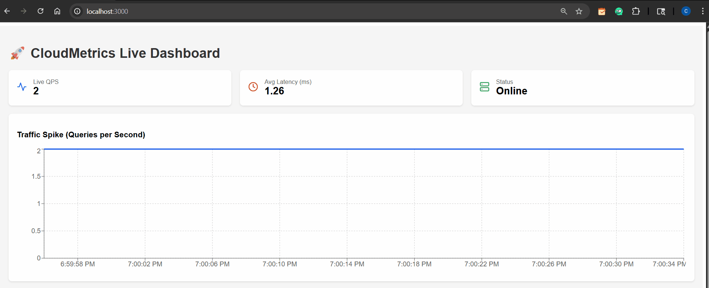

# 🚀 CloudMetrics

**A real-time PostgreSQL performance monitoring dashboard.**  
*Tracks live QPS, latency, and active connections with 1-second resolution.*



---

## 🛠 Tech Stack

- **Backend:** Python (Flask), Psycopg2  
- **Frontend:** React, Recharts, Vite  
- **Database:** PostgreSQL (with `pg_stat_statements`)  
- **Infrastructure:** Docker Compose (Local), CloudFormation (AWS-ready)

---

## ⚡ Quick Start (The “5-Minute” Promise)

### 1. Clone & Run
```bash
git clone https://github.com/MChandrahas/CloudMetrics
cd cloudmetrics
docker-compose up --build
````

### 2. View Dashboard

Open:
👉 [http://localhost:3000](http://localhost:3000)

### 3. Simulate Traffic

Run the load generator to see the charts spike:

```bash
docker-compose --profile tools up simulator
```

---

## 🏗 Architecture

```
[Simulator] --> [Postgres DB] <-- [Flask API] --> [React Dashboard]
```